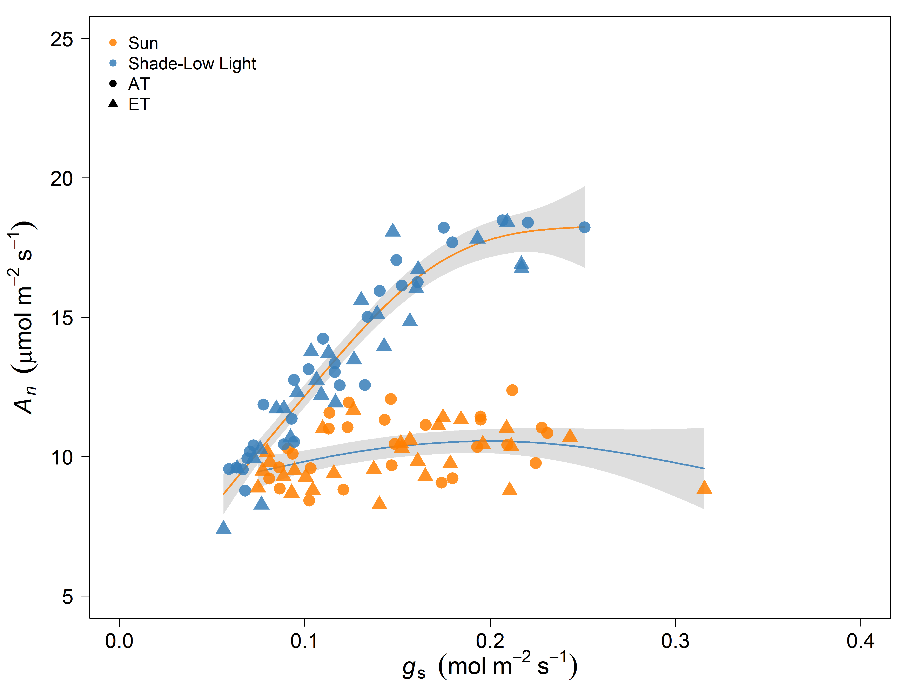
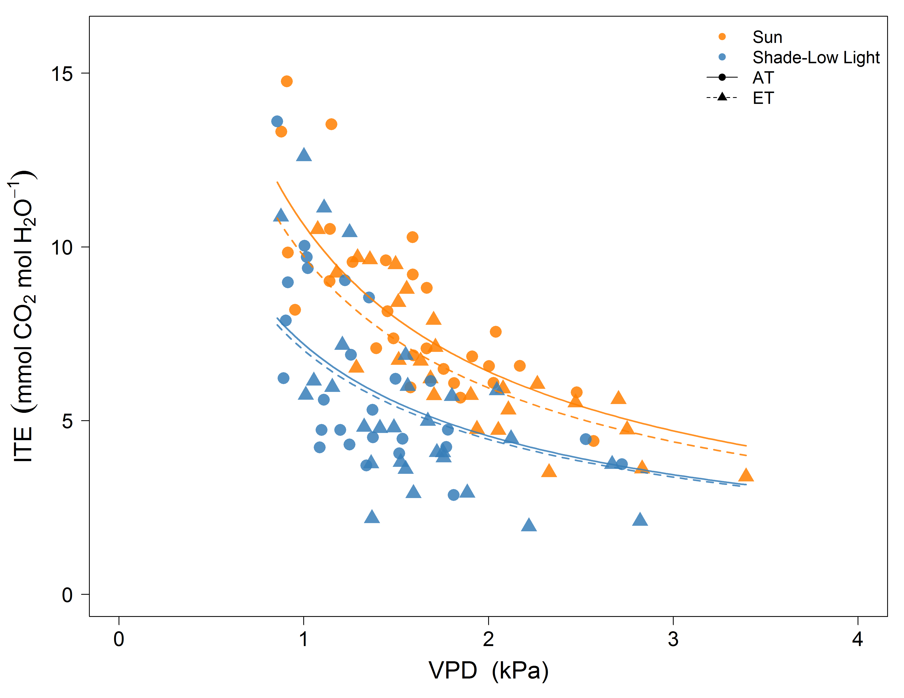

## About me

> - www.courtneycampany.com
>  - twitter @court_campany

--- .class #id bg:white

## insert leaflet

--- .class #id bg:white

## Reproducibility

> - Im a strong advocate of reproducibility in science, so....
>  - All code for this talk can be found @ https://github.com/CourtneyCampany/
>  - data & analysis for WTC1: github.com/CourtneyCampany/WTC1
>  - data & analysis for WTC3: github.com/CourtneyCampany/WTC_tree
>  - code for this talk: github.com/CourtneyCampany/WTC_talk

--- .class #id bg:white

## Whole Tree Chambers, Hawkesbury Forest Experiment
## climate change manipulations
## what they are:
## what they are not:

--- .class #id bg:white

## My interests revolve around understanding plant C gain and allocation
## 1. how trees are optimized for C gain
## 2. where does the C go
## Answering these question requires research that spans both leaf and whole tree scales

--- .class #id bg:white

## Today Ill show data from two experiments (WTCI and WTCIII)
## Attempt to address some knowledge gaps in canopy C gain and tree C allocation
## across mulptiple scales

--- .class #id bg:white

## These experiments are conducted with Eucalpytus species
## Why are eucalpyts important?
## Why do they make really nice model trees in investigate physiology

--- .class #id bg:white

## So today we will start small and work are way up...

--- .class #id bg:white

#Coupled response of stomatal and mesophyll conductance to light enhances photosynthesis of shade leaves under sunflecks

###Courtney E. Campany^1^, Mark G. Tjoelker^1^, Susanne von Caemmerer^2^, Remko A. Duursma^1^.

## ^1^ Hawkesbury Institute for the Environment, Western Sydney University, Locked Bag 1797, Penrith 2751 NSW, Australia

## ^2^ ARC Centre of Excellence for Translational Photosynthesis, Plant Science Division, Research School of Biology, The Australian National University, Canberra 2601 ACT, Australia

--- .class #id bg:white

## Leaves are reported to have an optimized behavior

### They should act to maximize carbon gain while minimizing costs 

http://cc61877.github.io/wtc3_talk/index.html#1

--- .class #id bg:white
## However...

--- .class #id bg:white
## For the canopy...Don't LEAF things to chance

> - <strong>Trees can't put all leaves in the sun</strong>
>  - Drives changes in anatomy, morphology and physiology
>  - Affects canopy resource distribution

> - <strong>Photosynthetic capacity ↓ in shade leaves</strong>

---&twocol bg:white
## Photosynthesis is a diffusion process

 

***=left

 
- Driven by resistances to CO2 into leaves and then to the site of carboxylation
- Stomatal <strong>(gs)</strong> and mesophyll <strong>(gm)</strong> conductance both limit photosynthesis 

> - Limitations result from costs and tradeoffs
> - <strong>We know little about these relationships within canopies</strong> 

***=right

---&twocol bg:white
##  Leaves experience light fluctuations daily

 
 
***=left

***=right

> - Are shade leaves optimized for low light or to respond to occasional high light

> - Beyond just photosynthetic capacity

> - gs responds slowly

> - gm anatomicaly constrained

> - <strong>Unfortunately, not enough empirical data available</strong>

---&twocol bg:white
## Sun and shade leaf physiology with the WTC3

***=right

 
> - <strong>12 whole tree chambers</strong>
>  - +3&deg;C ET treatments
>  - Minimal treatment effects found

> - <strong>Imposed drought in final months</strong>
>  - Focus on well watered trees 

> - <strong>Heaps of gas exchange over 6 months</strong>
>  - Sun and shade leaves
>  - Leaf temperature = air temperature
>  - Tunable diode laser for gm

---&twocol_left bg:white
## What's in a name? That which we call a ~~Rose~~ Leaf

***=right

 

> - Measuring two canopy extremes
>  - Sun: top of canopy in full light
>  - Shade: bottom and middle canopy in full shade
>  - Verified with quantum sensor and ceptometer

> - Leaves measured at current light environment
>  - Paired WTC compairsons
> - 'Lights On' for shade leaves
>  - Max sunfleck response

---&twocol bg:white
##  Are tree canopies optimized for carbon gain?

 
***=left

> - <strong>Do light gradients define leaf properties</strong>
>   - Resources and photosynthetic capacity (<strong>Amax</strong>) should be <strong>↑</strong> in sun leaves

***=right

> - <strong>Is the canopy optimized to <strong>↑</strong> C gain while <strong>↓</strong> water loss?</strong>
>   - Then gs will be  proportional to photosynthesis across all leaves
 
> - <strong>What is the role of gm as its costs are less clear?</strong>
>   - If Amax is  in sun leaves then <strong>↑</strong>gm should be too

--- .class #id bg:white
## 75% reduction in direct light to shade leaves

--- &carousel bg:white 
## Photosynthetic capacity reduced in shade leaves

*** {class: active, img: "assets/img/white.png"}

*** {img: "assets/img/aci.png"}
Vcmax and Jmax <strong>↑</strong> in sun leaves

*** {img: "assets/img/photonitro.png"}
~25% higher Leaf Nitrogen in sun

--- .class #id bg:white
## Shade leaves exhibited apparent inefficient water use relative to photosynthesis

--- .class #id bg:white
## <strong>↓</strong> WUE from sub-optimal behavior of gs

--- &carousel_nocap bg:white 
## Does the answer lie within sunflecks?

*** {class: active, img: "assets/img/ags1.png"}
Shade leaves = sun leaves

*** {img: "assets/img/agsbar.png"}
Do shade leaves 'lie in wait'?

---.class #id bg:white
##Functional properties of **Eucalpytus** leaves and canopies

> - checklist here of findings on leaf angle (king...for leaf temp control in hot dry regions, but occur in wetter regions )
> - stomata on both sides ()
> - sunfleck research focuses heavily on understory, but what about within the canopy
> - Eucakpys tend to have a much sparser canopy than say a a oak tree, also everygreen so C gain year round
> - enhancing light interception is so important in canopy C gain, and for us as we scale up

---&twocol bg:white
## The need to investigate within the canopy

 

***=left

 
> - <strong>Can we reject the hypothesis that leaves are optimized throughout the canopy?</strong> 
>  - 
Sun leaves utlize higher N while minimizing water loss (&#10003;)

>  - 
gm proportional to photosynthesis... and also 'ready to go' (&#10003;)

>  - 
gs and photosynthesis decoupled in shade (&#10008;)
 

---&twocol_left bg:white
## Measuring shade leaves: Whats to gain?

 

***=right

 
> - <strong>Why are shade leaves wasting water?</strong>

>  - Leaves prepared to 'slow' response of gs?
>  - Economy of physiology
>  - <strong>↑</strong> water loss to potentially turn shade leaves into sun leaves?
>  - gm is the key

> - <strong>Implications for scaling leaf level measurments to the canopy</strong>

---.class #id bg:white

http://cc61877.github.io/wtc3_talk/index.html#1

click through for additional figures

--- .class #id bg:white

## Now I would like to move up in scale and talk about canopy fluxes and whole tree C allocation
## Using the unique ability of the WTC to measure high resoultion C and H20 fluxes
## extremly relevant for predicting climate change effects on forest ecosystems
## as we want to determine how net canopy C gain is allocated and does this change

--- .class #id bg:white

##background
## duke facem ornl face

--- .class #id bg:white

##drawbacks to these study are real
###integrated soil respirtion measuremnets
## but if the power of WTC design allows us to resolve these much more simply

--- .class #id bg:white

##chamber setup for fluxes
##seperate of soil respirtory flux (important)

--- .class #id bg:white

##allometry of aboveground, done extremely well

--- .class #id bg:white

##this then allows us to determine TBCA in absolute C terms
## mass balance

--- .class #id bg:white

--- .class #id bg:white

##mass partitioning vs C allocation
## what u see and what u see + what goes in to making what u see

--- .class #id bg:white

##Whole Tree Chamber I design
## CO2 x Drought

--- .class #id bg:white

##Once trees are large enough, chamber floors go in and then chamber fluxes can start
##here we generate fluxes over the last 11 months of the experiment

--- .class #id bg:white

##aboveground biomass through time

--- .class #id bg:white

##leaf are through time

--- .class #id bg:white

##strong relationship between leaf area and C flux

