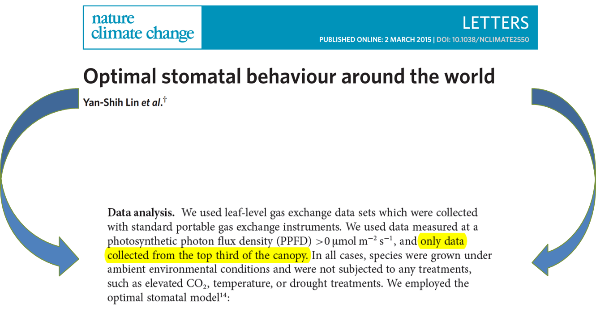
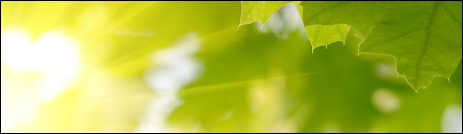
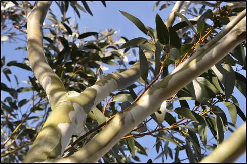
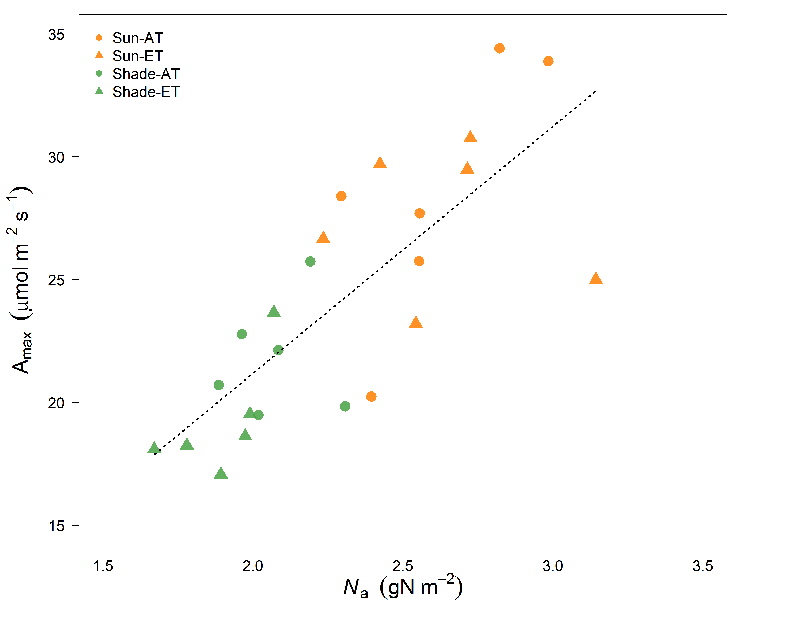

---
title       : Understanding resource allocation in Eucalyputus trees,
              using Whole Tree Chambers
author      : Court Campany
job         : Research Fellow, Hawkesbury Institute for the Environment
framework   : io2012        # {io2012, html5slides, shower, dzslides, ...}
highlighter : highlight.js  # {highlight.js, prettify, highlight}
hitheme     : tomorrow      # 
widgets     : [bootstrap, quiz,shiny, interactive]# {mathjax, quiz, bootstrap}
ext_widgets: {rCharts: [libraries/nvd3]}
mode        : selfcontained # {standalone, draft}
knit        : slidify::knit2slides
logo        : hielogo.png
--- .class #id bg:white

## About me:

 
 

* Plant Ecophysologist
* Ecosystem Ecologist

 
* www.courtneycampany.com
* twitter @court_campany

--- .class #id bg:white
## Science Background

*leaflet goes here

--- .class #id bg:white

## Research: Tree carbon uptake and carbon allocation

 

* How are trees optimized for C gain?
  + physiology, resource distribution and anatomy
  + will future global change affect these processes?
  
 
* Where does this C go?
  + fate of photosynthetic C through trees
  + source vs sink activity
  + providing empirical data to models
  

--- &twocol bg:white
## Resource allocation is important at multiple scales

 

***=left
  + Resource allocation (H20, N, P) regulates leaf photosynthesis
  + Canopy light gradients control resource distribution which alters leaf physiological behavior
  + Sum uptake of all leaves determines net canopy C uptake
  + Canopy C must then be allocated, as a resource, to growth, storage, reproduction and loss

***=right

--- .class #id bg:white

## Whole Tree Chambers, Hawkesbury Forest Experiment

 
* Novel experimental infrastructure with 12 chambers, 1 tree per each
  +imported to HIE from Sweden
  +retrofitted to work in Australian climate
  
 
* Use to address some knowledge gaps in canopy C gain and tree C allocation
  +across multiple scales
 
*http://www.uws.edu.au/hie/facilities/whole_tree_chambers  
  
--- .class #id bg:white

## Whole Tree Chambers, Hawkesbury Forest Experiment

 
* Manipulate climate change factors
  + CO2, Precipation and Warming
  + interactions between these factors
 
* excellent environmental control:
  + tight control of temperature and RH allow VPD to be controlled in warming experiments
  + real time control of CO2 levels allows for ^13C studies to be completed  

--- .class #id bg:white 

## Whole Tree Chambers, Hawkesbury Forest Experiment

 
* What they are:
  + tools for plant physiological research
  + excellent manipulative control of climate change factors
  + a step beyond seedling based physiology experiments
  + access to entire canopy
   
   
* What they are not:
  + a proxy for ecosystem level processes
  

--- --- &twocol bg:white

***=left

***=right

 
 
### Coupled response of stomatal and mesophyll conductance to light enhances photosynthesis of shade leaves under sunflecks
 
 
 
 
 
 
Courtney E. Campany
 
Mark G. Tjoelker 
 
Susanne von Caemmerer 
 
Remko A. Duursma

--- .class #id bg:white

## Leaves are reported to have an optimized behavior

### They should act to maximize carbon gain while minimizing costs 

--- .class #id bg:white
## However...

---.class #id bg:white
## Are whole canopies optimized for C gain?

 
 
 
 
 
 
 
 
 
> - Light gradient determines leaf properties
 

> - N and H2O both distributed to sun leaves
 

> - Maximizes photosynthesis (theoritically)

--- .class #id bg:white
## For the canopy...Don't LEAF things to chance

> - <strong>Trees can't put all leaves in the sun</strong>
>  - Drives changes in anatomy, morphology and physiology
>  - Affects canopy resource distribution

> - <strong>Photosynthetic capacity ↓ in shade leaves</strong>

---&twocol bg:white
## Photosynthesis is a diffusion process

 

***=left

 
- Driven by resistances to CO2 into leaves and then to the site of carboxylation
- Stomatal <strong>(gs)</strong> and mesophyll <strong>(gm)</strong> conductance both limit photosynthesis 

> - Limitations result from costs and tradeoffs
> - <strong>We know little about these relationships within canopies</strong> 

***=right

---&twocol bg:white
##  Leaves experience light fluctuations daily

 
 
***=left

***=right

> - Are shade leaves optimized for low light or to respond to occasional high light

> - Beyond just photosynthetic capacity

> - gs responds slowly

> - gm anatomicaly constrained

> - <strong>Unfortunately, not enough empirical data available</strong>

---&twocol bg:white
## Sun and shade leaf physiology with the WTC3

***=right

 
> - <strong>12 whole tree chambers</strong>
>  - +3&deg;C ET treatments
>  - Minimal treatment effects found

> - <strong>Imposed drought in final months</strong>
>  - Focus on well watered trees 

> - <strong>Heaps of gas exchange over 6 months</strong>
>  - Sun and shade leaves
>  - Leaf temperature = air temperature
>  - Tunable diode laser for gm

---&twocol_left bg:white
## What's in a name? That which we call a ~~Rose~~ Leaf

***=right

 

> - Measuring two canopy extremes
>  - Sun: top of canopy in full light
>  - Shade: bottom and middle canopy in full shade
>  - Verified with quantum sensor and ceptometer

> - Leaves measured at current light environment
>  - Paired WTC compairsons
> - 'Lights On' for shade leaves
>  - Max sunfleck response

---&twocol bg:white
##  Are tree canopies optimized for carbon gain?

 
***=left

> - <strong>Do light gradients define leaf properties</strong>
>   - Resources and photosynthetic capacity (<strong>Amax</strong>) should be <strong>↑</strong> in sun leaves

***=right

> - <strong>Is the canopy optimized to <strong>↑</strong> C gain while <strong>↓</strong> water loss?</strong>
>   - Then gs will be  proportional to photosynthesis across all leaves
 
> - <strong>What is the role of gm as its costs are less clear?</strong>
>   - If Amax is  in sun leaves then <strong>↑</strong>gm should be too

--- .class #id bg:white
## 75% reduction in direct light to shade leaves

--- &twocol bg:white
## Photosynthetic capacity and resource distribution

***=left

***=right
 
> - Amax reduced in shade
> - ~25% higher Leaf Nitrogen in sun
> - Kl higher in shade?

--- .class #id bg:white
## Shade leaves exhibited apparent inefficient water use

--- .class #id bg:white
## <strong>↓</strong> WUE from sub-optimal behavior of gs

--- .class #id bg:white
## <strong>↓</strong> WUE from sub-optimal behavior of gs

--- .class #id bg:white
## Does the answer lie within sunflecks?

--- &twocol bg:white
## Dynamic physiology: total conductance to CO2

***=left
 

***=right
 
 
 
> - Stomatal response generally considered slow
> - Increases CO2 in intercellular airspaces, but...
> -  <strong>Thats not where the magic happens</strong>

--- .class #id bg:white
## Rapid <strong>↑</strong> in gm enables sunfleck response

--- .class #id bg:white
## Do shade leaves 'lie in wait'?

---.class #id bg:white
## Future work:  How general is this response?

 

> - <strong>Sunfleck research focuses heavily on understory, but what about within the canopy?</strong>
>  - Enhancing light interception is so important in canopy C gain, and for us as we scale up

 
> - <strong>Functional properties of eucalpytus leaves and canopies</strong> 
>  - Vertical leaf angles
>  - Stomata on both sides of the leaf
>  - Sparse canopies 
>  - Everygreen: year roudn C gain

