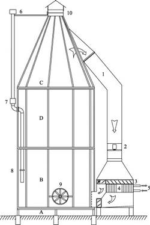
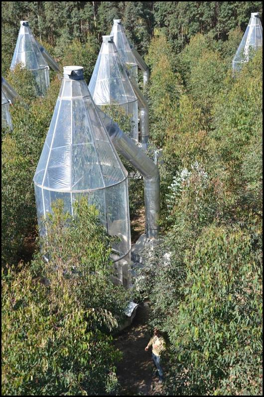
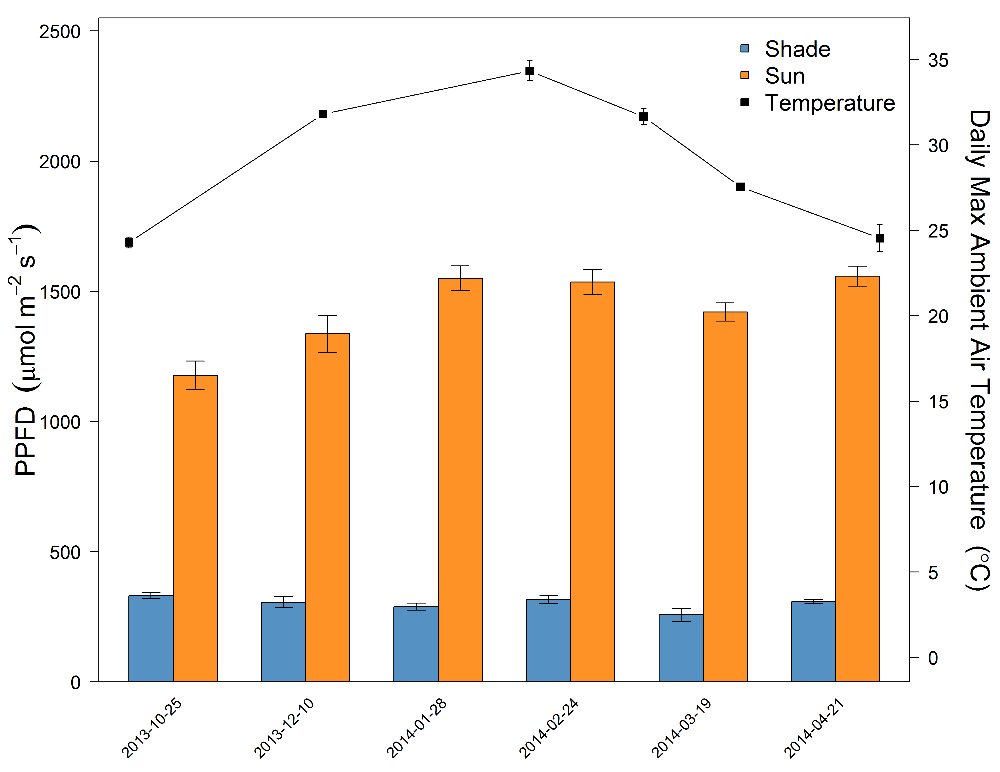
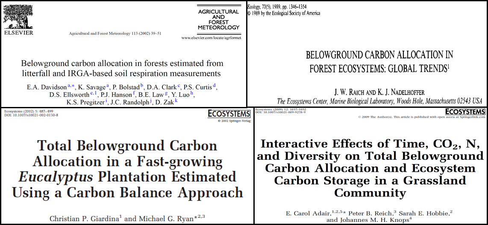

---
title       : Understanding resource allocation in Eucalyputus trees,
              using Whole Tree Chambers
author      : Court Campany
job         : Research Fellow, Hawkesbury Institute for the Environment
framework   : io2012        # {io2012, html5slides, shower, dzslides, ...}
highlighter : highlight.js  # {highlight.js, prettify, highlight}
hitheme     : tomorrow      # 
widgets     : [bootstrap, quiz,shiny, interactive]# {mathjax, quiz, bootstrap}
ext_widgets: {rCharts: [libraries/nvd3]}
mode        : selfcontained # {standalone, draft}
knit        : slidify::knit2slides
logo        : hielogo.png
--- .class #id bg:white

## About me:

 
 

* Plant Ecophysologist
* Ecosystem Ecologist

 
* www.courtneycampany.com
* twitter @court_campany

--- .class #id bg:white
## Science Background

*leaflet goes here

--- &twocol bg:white
## WTC3: Resource distrubution of *Eucalpytus tereticornis*

***=left
 
* <strong>Leaf Nitrogen </strong>
 + each sun/shade leaves from gas exchange

 
* <strong>Leaf Hydraulics</strong>
 + Predawn / Midday water potentials
 + Leaf transpiration from gas exchange
 + Leaf specific hydraulic conductance

***=right
 
* <strong>Water Use Efficiency</strong>
 + ITE = Photosynthesis / Transpiration
 + g1 = ITE vs. VPD (water use strategy)
 + delta^13C = WUE over leaf lifespan

--- .class #id bg:white

## Research: Tree carbon uptake and carbon allocation

 

* How are trees optimized for C gain?
  + physiology, resource distribution and anatomy
  + will future global change affect these processes?
  
 
* Where does this C go?
  + fate of photosynthetic C through trees
  + source vs sink activity
  + providing empirical data to models
  

--- &twocol bg:white
## Resource allocation is important at multiple scales

 

***=left
  + Resource allocation (H20, N, P) regulates leaf photosynthesis
  + Canopy light gradients control resource distribution which alters leaf physiological behavior
  + Sum uptake of all leaves determines net canopy C uptake
  + Canopy C must then be allocated, as a resource, to growth, storage, reproduction and loss

***=right

--- .class #id bg:white

## Whole Tree Chambers, Hawkesbury Forest Experiment

* <strong>Novel experimental infrastructure with 12 climate controlled chambers</strong>
  + 1 tree per chamber
  + Imported to HIE from Sweden, retrofitted to work in Australian climate

--- .class #id bg:white

## Whole Tree Chambers, Hawkesbury Forest Experiment

 
* <strong>Global change manipulations</strong>
  + CO2, Precipation and Warming
  + interactions between these factors
   
* <strong>Excellent environmental control:</strong>
  + Tight control of temperature and RH 
  + CO2 control allows for ^13C studies to be completed 
 
* <strong>Address questions in leaf and canopy physiology and tree C allocation</strong>
  + canopy fluxes and canopy access for leaf-scale research
  + large root enclosure for full biomass harvest

--- .class #id bg:white 

## Whole Tree Chambers, Hawkesbury Forest Experiment

 
* <strong>What they are:</strong>
  + tools for plant physiological research
  + excellent manipulative control of climate change factors
  + a step beyond seedling based physiology experiments
  + access to entire canopy
   
   
* <strong>What they are not:</strong>
  + a proxy for ecosystem level processes
  

## Dynamic leaf physiology within tree canopies

--- --- &twocol bg:white

***=left

***=right

 
 
### Coupled response of stomatal and mesophyll conductance to light enhances photosynthesis of shade leaves under sunflecks
 
 
 
 
 
 
Courtney E. Campany
 
Mark G. Tjoelker 
 
Susanne von Caemmerer 
 
Remko A. Duursma

--- .class #id bg:white

## Leaves are reported to have an optimized behavior

### They should act to maximize carbon gain while minimizing costs 

--- .class #id bg:white
## However...

---.class #id bg:white
## Are whole canopies optimized for C gain?

 
 
 
 
 
 
 
 
 
> - Light gradient determines leaf properties
 

> - N and H2O both distributed to sun leaves
 

> - Maximizes photosynthesis (theoritically)

--- .class #id bg:white
## For the canopy...Don't LEAF things to chance

> - <strong>Trees can't put all leaves in the sun</strong>
>  - Drives changes in anatomy, morphology and physiology
>  - Affects canopy resource distribution

> - <strong>Photosynthetic capacity ↓ in shade leaves</strong>

---&twocol bg:white
## Photosynthesis is a diffusion process

 

***=left

 
- Driven by resistances to CO2 into leaves and then to the site of carboxylation
- Stomatal <strong>(gs)</strong> and mesophyll <strong>(gm)</strong> conductance both limit photosynthesis 

> - Limitations result from costs and tradeoffs
> - <strong>We know little about these relationships within canopies</strong> 

***=right

---&twocol bg:white
##  Leaves experience light fluctuations daily

 
 
***=left

***=right

+ Are shade leaves optimized for low light or to respond to occasional high light

+ Beyond just photosynthetic capacity
 
+ gs responds slowly

+ gm anatomicaly constrained

> - <strong>Unfortunately, not enough empirical data available</strong>

---&twocol bg:white
## WTC3: Leaf physiology of *Eucalpytus tereticornis*

***=right

 
* <strong>Climate warming treatment</strong>
 + +3&deg;C ET treatments
 + Minimal treatment effects found

* <strong>Imposed drought in final months</strong>
 + Focus on well watered trees 

* <strong>Heaps of gas exchange over 6 months</strong>
 + Sun and shade leaves
 + Leaf temperature = air temperature
 + Tunable diode laser for gm
 

---&twocol_left bg:white
## What's in a name? That which we call a ~~Rose~~ Leaf

***=right

 

* <strong>Measuring two canopy extremes</strong>
 + Sun: top of canopy in full light
 + Shade: bottom and middle canopy in full shade
 + Verified with quantum sensor and ceptometer

* <strong>Leaves measured at current light environment</strong>
 + Paired WTC compairsons
 + 'Lights On' for shade leaves
 +  Max sunfleck response (fluxes stable)
 
--- &twocol bg:white

 
---&twocol bg:white
##  Are tree canopies optimized for carbon gain?

 
***=left

> - <strong>Do light gradients define leaf properties</strong>
>   - Resources and photosynthetic capacity (<strong>Amax</strong>) should be <strong>↑</strong> in sun leaves

***=right

> - <strong>Is the canopy optimized to <strong>↑</strong> C gain while <strong>↓</strong> water loss?</strong>
>   - Then gs will be  proportional to photosynthesis across all leaves
 
 
> - <strong>What is the role of gm as its costs are less clear?</strong>
>   - If Amax is  in sun leaves then <strong>↑</strong>gm should be too

--- .class #id bg:white
## 75% reduction in direct light to shade leaves

--- &twocol bg:white
## Photosynthetic capacity and resource distribution

***=left

***=right
 
* <strong>Amax reduced in shade</strong>
* <strong>~25% higher Leaf Nitrogen in sun</strong>
* <strong>Leaf hydraulic conductancehigher in shade?</strong>

--- .class #id bg:white
## Shade leaves exhibited apparent inefficient water use

--- .class #id bg:white
## <strong>↓</strong> WUE from sub-optimal behavior of gs

--- .class #id bg:white
## <strong>↓</strong> WUE from sub-optimal behavior of gs

--- .class #id bg:white
## Does the answer lie within sunflecks?

--- &twocol bg:white
## Dynamic physiology: total conductance to CO2

***=left
 

***=right
 
 
 
> - Stomatal response generally considered slow
> - Increases CO2 in intercellular airspaces, but...
> - <strong>Thats not where the magic happens</strong>

--- .class #id bg:white
## Rapid <strong>↑</strong> in gm enables sunfleck response

--- .class #id bg:white
## Do shade leaves 'lie in wait'?

---.class #id bg:white
## Future work:  How general is this response?

 

> - <strong>Sunfleck research focuses heavily on understory, but what about within the canopy?</strong>
>  - Enhancing light interception is so important in canopy C gain, and for us as we scale up

 
> - <strong>Functional properties of eucalpytus leaves and canopies</strong> 
>  - Vertical leaf angles
>  - Stomata on both sides of the leaf
>  - Sparse canopies 
>  - Everygreen: year round C gain

---&twocol_left bg:white
## Moving forward: leaf to canopy economic spectrum

***=right

 
> - <strong>How do trees optimize canopy C gain</strong>

>  - Resource distribution
>  - Dynamic leaf physiology (gm)
>  - Anatomy

> - <strong>Implications for scaling leaf level measurments to the canopy</strong>

--- .class #id bg:white

## Canopy C fluxes and whole tree C allocation

--- .class #id bg:white
## Background: modeling C allocation is a hot issue

--- .class #id bg:white
## Background: modeling C allocation is a hot issue

> - <strong>Requires knowledge of global change impacts on forest ecosystems</strong>
>  - How is net canopy C gain affected?
>  - Is tree C allocation fixed or dymanic?
>  - What components of allocation are most affected?

> - <strong>Allocation schemes are necessary to constrain models</strong>

--- .class #id bg:white
## Strong focus on belowground C allocation (TBCA)

--- .class #id bg:white
## TBCA and global change: FACE studies

 
 
 
 
 
 
 
 
 
 
> - <strong>TBCA enhanced under eCO2</strong>
>  - Fine roots (Iversen et al. 2010)
>  - Exudation (Phillips et al. 2011)

--- .class #id bg:white
## Drawbacks to these study are real

 
> - <strong>TBCA esimated as a resdiual</strong>
>  -  Soil respiration - C pools of litter, soils and roots
>  -  Assumes steady-state conditions

 
> - <strong>Soil respiration scaled up</strong>
>  -  point measurements (monthly) to yearly fluxes

 
> - <strong>TBCA is really hard to estimate</strong>

--- .class #id bg:white
## Can the WTC provide a better empirical solution?

 
> - <strong>High resoultion C and H20 fluxes (14 min)</strong>
> - <strong>Ability to track/harvest biomass</strong>
> - <strong>separation of soil respirtory flux</strong>

--- .class #id bg:white
## WTC: Mass balance approach

--- .class #id bg:white
## WTCI: CO2 x Drought with *Eucalpytus saligna*

 

> - <strong>*Eucalpytus saligna* or Sydney blue gum</strong>
>  - important global plantation species
>  - utilized in numerous climate change manipulation studies

 
> - <strong>Full factorial treatment design</strong>
>  - 6 WTC at ambient CO2 of 380 ppm and 6  at eCO2 of +240 ppm above ambient
>  - 4 month drought (no watering) during chamber flux period

--- .class #id bg:white
## WTC1: Whole Tree CO2 flux

 
> - <strong>Hybrid open-mode - null-balance gas exchange system</strong>
>  - 30m^3 air volume, fresh air supply at 10L s^-1
>  - Pure CO2 injected to reach target
>  - IRGA samples every 60 sec (14 min cycle all WTCs/2 reference lines)

 
> - <strong>CO2 flux from mass balance of CO2 entering and leaving the chamber with chamber ventilation</strong>

--- .class #id bg:white
## Calculating tree C allocation

> - <strong>Once trees are large enough, chamber floors go in and then chamber fluxes start</strong>
>  - Continuous aboveground C fluxes over 11 months

> - <strong>Allometric surveys fortnightly</strong>
>  - Height, diameter at regular intervals, leaf litter and leaf counts
>  - Branch counts and lengths through time

> - <strong>Biomass harvest by structural compoents</strong>
>  - Density of branches, bole wood, bole bark
>  - Specific leaf area (SLA)

--- .class #id bg:white
## Component C allocation with mass balance

> - <strong>Harvest</strong>
>  - C content = 50% of dry biomass
>  - TBCA = Cumulative CO2 flux  - Branch + Bole + Leaf mass
>  - TBCA - Root mass = Root turnover + exudation + microbial respiration)

 
> - <strong>Daily time steps</strong>
>  - Cumulative CO2 flux per time step
>  - Volume and density to calculate wood mass</strong>
>  - Modelled leaf area (daily) and SLA to predict leaf mass

 
> - <strong>To what degree is C allocation fixed under global change?</strong>

--- .class #id bg:white
## 1^st Step: Defining C allocation

 
> -  <strong>*Mass partitioning*:  the relative distribution of biomass between different tree tissue components such as leaves, branches, bole and roots.</strong>

 
> - <strong>*Carbon allocation*: the fraction of canopy photosynthesis distributed to different components such as tissue biomass pools, respiratory C fluxes, non-structural carbohydrate storage pools or root C exudation.</strong>

--- .class #id bg:white
## 2^nd Step: Differentiating between the two

> - Changes in C allocation encompass effects of tissue turnover, the storage and use of carbohydrates and root exudation  > - Each represents a significant responses to environmental change.
 > - patterns in biomass partitioning and C allocation may not be consistent with respect to the tissue in question,  
 > - contributes to the current uncertainty in modelling tree growth responses climate change .

> - <strong>Tissue specific C allocation represents the fraction of net canopy C uptake distributed to a given tissue</strong>
 > - WTC1: Leafm = Leafa * Canopy Flux C - Leaft)
 > - Solve for allocation
 > - WTC1:  Leafa = (Leafm - Leaft) / Canopy Flux C 

--- .class #id bg:white
## Leaf area reduced in CO2

--- .class #id bg:white
## Leaf area and  tree C uptake strongly related

--- .class #id bg:white
## Leads to similar reduction in harvested mass

--- .class #id bg:white
## Relationship between tree C flux and biomass

 
> - <strong>Difficult to empirically measure</strong>
>  - Shown to be poorly related (Litton et al. 2007)

 
> - <strong>Advantages of WTC</strong>
>  - allows testing of the coordination of canopy photosynthesis and growth
>  - can examine over longer time periods
>  - strongly correlated over 2.5 fold size range in *Eucalyptus* trees

--- .class #id bg:white
## Stem C mass reduced under CO2 after ~1yr

--- .class #id bg:white
## LMF and C allocation to leaves increased under CO2

--- .class #id bg:white
## TBCA ~50%

--- .class #id bg:white
## Is tree C allocation fixed?

--- .class #id bg:white
## Is tree C allocation fixed?

--- .class #id bg:white
## Conclusions: Tree C allocation, getting it right

 
> - <strong>Implications for how C allocation should be represented in process-based forest models</strong>
> - Empirically defined C allocation patterns constrained by functional relationships with biomass production are needed to reduce uncertainty and improve model predictions (De Kauwe et al 2014)
> - Even if TBCA doesnt change, belowground components still can

 
> - <strong>Measuring biomass just not enough</strong>
> - Here, insufficient to explain responses of tree growth to eCO2

--- .class #id bg:white

## Conclusions: Understanding canopy C gain

--- .class #id bg:white
## Conclusions: Canopy C gain, getting it right

--- .class #id bg:white
## Reproducibility

 
 
* <strong>All code for this talk can be found @ https://github.com/CourtneyCampany/</strong>

 

* data & analysis for WTC1: github.com/CourtneyCampany/WTC1
* data & analysis for WTC3: github.com/CourtneyCampany/WTC_tree
* code for this talk: github.com/CourtneyCampany/wtc_seminar

---.class #id bg:white

http://cc61877.github.io/wtc3_talk/index.html#1

