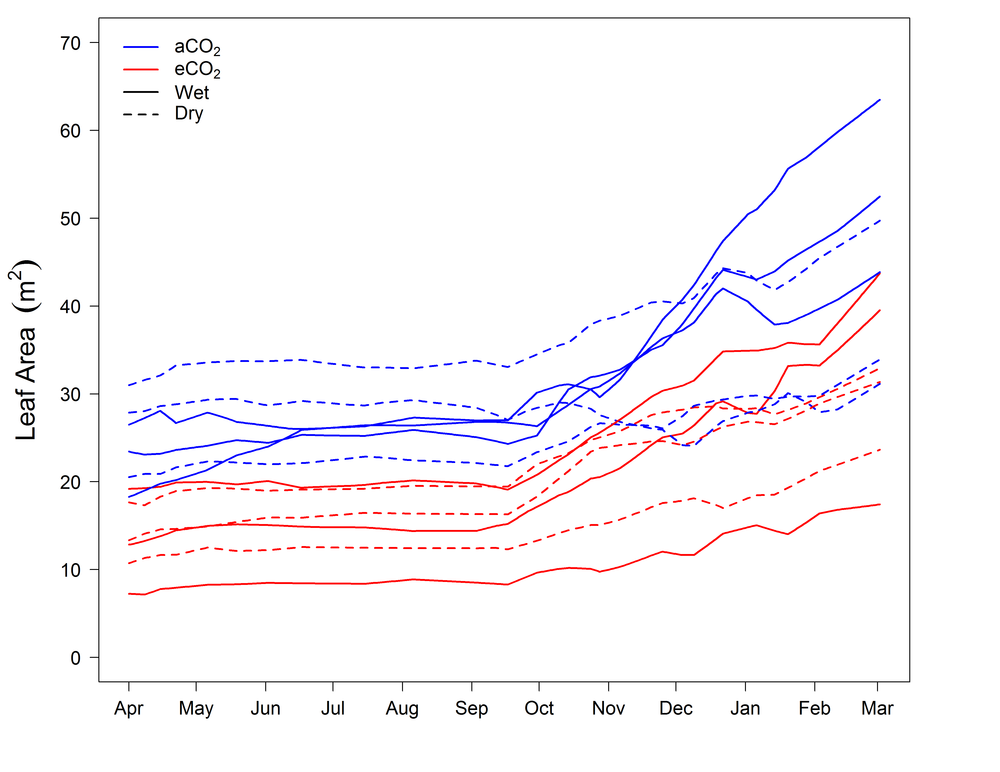
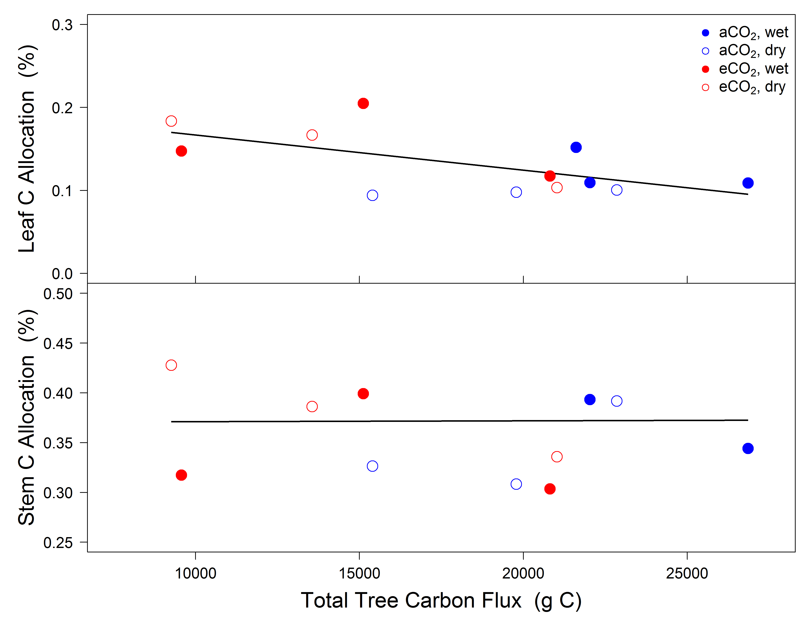

---&twocol bg:white
## The need to investigate within the canopy

 

***=left

 
> - <strong>Can we reject the hypothesis that leaves are optimized throughout the canopy?</strong> 
>  - 
Sun leaves utlize higher N while minimizing water loss (&#10003;)

>  - 
gm proportional to photosynthesis... and also 'ready to go' (&#10003;)

>  - 
gs and photosynthesis decoupled in shade (&#10008;)
 

---&twocol_left bg:white
## Measuring shade leaves: Whats to gain?

 

***=right

 
> - <strong>Why are shade leaves wasting water?</strong>

>  - Leaves prepared to 'slow' response of gs?
>  - Leaf economics
>  - <strong>↑</strong> water loss to potentially turn shade leaves into sun leaves?
>  - gm is the key

> - <strong>Implications for scaling leaf level measurments to the canopy</strong>

--- .class #id bg:white

## Now I would like to move up in scale and talk about canopy fluxes and whole tree C allocation
## Using the unique ability of the WTC to measure high resoultion C and H20 fluxes
## extremly relevant for predicting climate change effects on forest ecosystems
## as we want to determine how net canopy C gain is allocated and does this change

--- .class #id bg:white

##background
## duke facem ornl face

--- .class #id bg:white

##drawbacks to these study are real
###integrated soil respirtion measuremnets
## but if the power of WTC design allows us to resolve these much more simply

--- .class #id bg:white

##WTC chamber setup for fluxes
##seperate of soil respirtory flux (important)

--- .class #id bg:white

##WTC 1 design
### *Eucalpytus saligna* or Sydney Blue gum

> - *Eucalpytus saligna* or Sydney Blue gum

>  - common plantation species due to valuable hardwood
>  - important ecologically as a component of endangered Blue Gun High forest on east coast of OZ
>  - previously utilized in numerous manupulative climate change experiments

--- .class #id bg:white

##allometry of aboveground, done extremely well

--- .class #id bg:white

##this then allows us to determine TBCA in absolute C terms
## mass balance

--- .class #id bg:white

--- .class #id bg:white

##mass partitioning vs C allocation
## what u see and what u see + what goes in to making what u see

--- .class #id bg:white

##Whole Tree Chamber I design
## CO2 x Drought

--- .class #id bg:white

##Once trees are large enough, chamber floors go in and then chamber fluxes can start
##here we generate fluxes over the last 11 months of the experiment

--- .class #id bg:white

##use allometry to track allocation through time (aboveground)

--- .class #id bg:white

##leaf are through time

--- .class #id bg:white

##strong relationship between leaf area and C flux

--- .class #id bg:white

##use allometry to track allocation through time (aboveground)

--- .class #id bg:white

##how was mass partitioing and C allocation impacted after ~1yr?

--- .class #id bg:white

##Does climate change really alter TBCA?

--- .class #id bg:white

##Conclusions: Understanding canopy C gain

--- .class #id bg:white

##Conclusions: Canopy C gain, getting it right

--- .class #id bg:white

##Conclusions: Tree C allocation, fixed or not?

--- .class #id bg:white
##Conclusions: Tree C allocation, getting it right

* Manipulate climate change factors
  + CO2, Precipation and Warming
  + interactions between these factors
 
* excellent environmental control:
  + tight control of temperature and RH allow VPD to be controlled in warming experiments
  + real time control of CO2 levels allows for ^13C studies to be completed 

--- .class #id bg:white
## Reproducibility

 
 
* All code for this talk can be found @ https://github.com/CourtneyCampany/

 

* data & analysis for WTC1: github.com/CourtneyCampany/WTC1
* data & analysis for WTC3: github.com/CourtneyCampany/WTC_tree
* code for this talk: github.com/CourtneyCampany/wtc_seminar

---.class #id bg:white

http://cc61877.github.io/wtc3_talk/index.html#1

